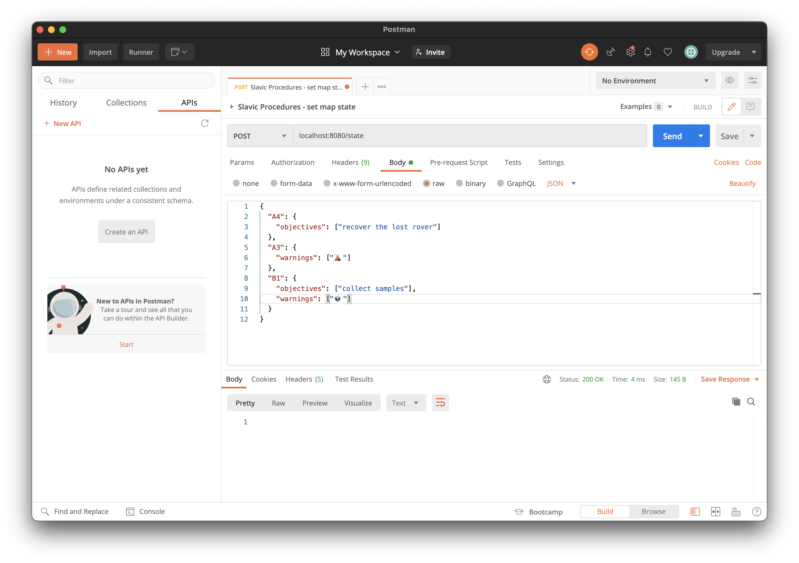
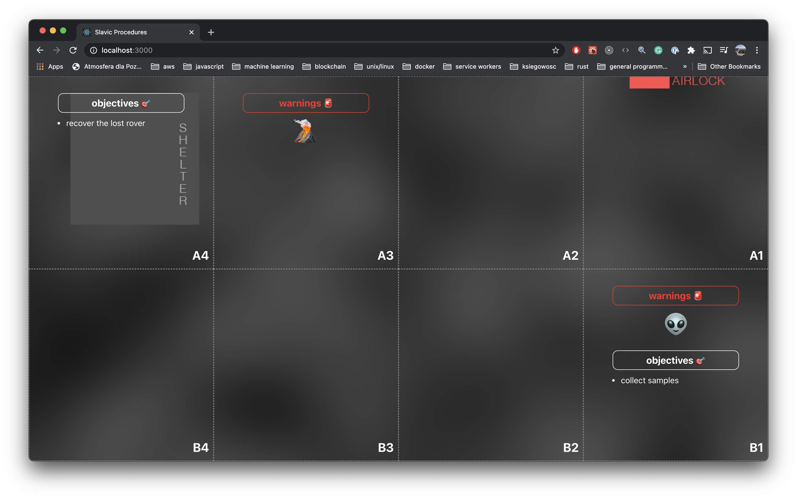

# lunares map server

This is a simple HTTP + WS server for dispatching map events & warnings, that are broadcasted in real time to all client applications.

## requirements

1. node.js (tested with v15.8.0)
2. yarn (tsted with v1.16.0)

## instructions to run

1. run `yarn` to install packages
2. run `yarn start` to run the server (with nodemon)
3. the HTTP server runs on port 8080, while the WS (websocket) feed runs on port 8079

## how to use

1. in order to set a lunar map's state, simply send a POST rquest to `localhost:8080/state` (eg. using Postman app)
2. example payload:
```json
{
  "A4": {
    "objectives": ["recover the lost rover"]
  },
  "A3": {
    "warnings": ["🌋"]
  },
  "B1": {
    "objectives": ["collect samples"],
    "warnings": ["👽"]
  }
}
```
3. there are A1 to A4 and B1 to B4 tiles available.
4. all client applications (maps) should automatically receive a broadcasted message and update the UI accordingly

## example
Issuing an HTTP POST in Postman to set the map's state


Map UI

